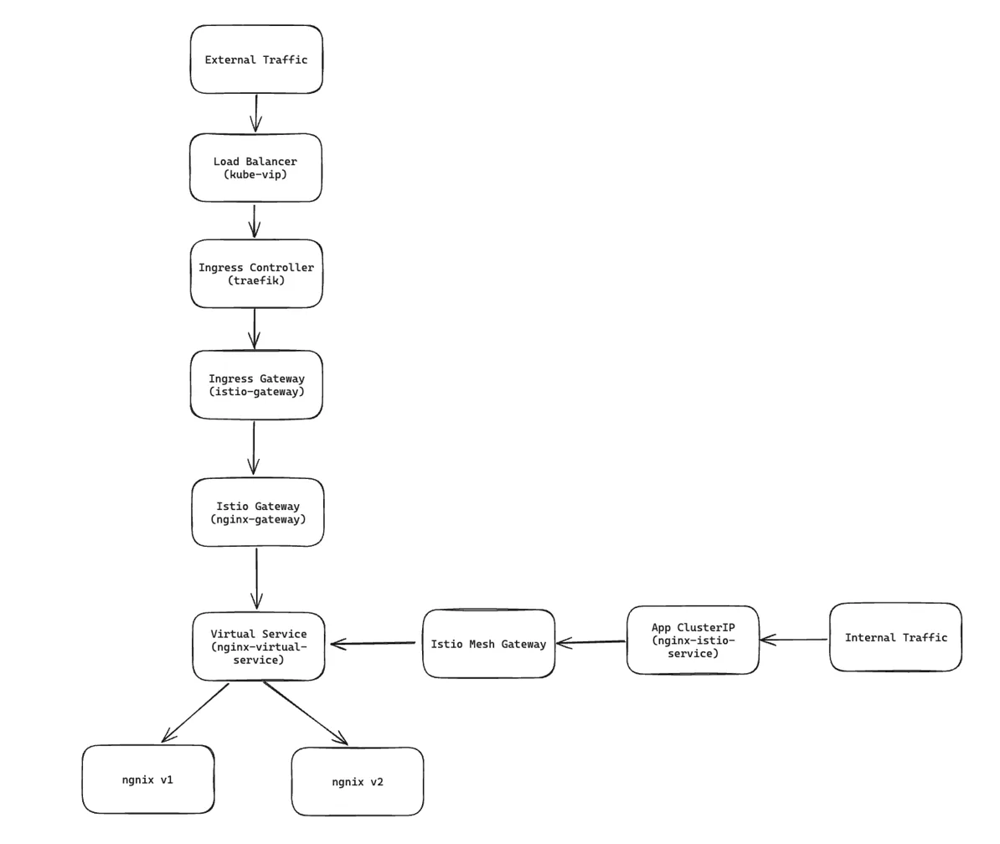

# Установка Istio Service Mesh

Руководство по установке Istio Service Mesh.

## Обзор

После установки у нас получится следующая архитектура сетевого взаимодействия в кластере:



**Официальная документация**: https://istio.io/latest/docs/setup/install/helm/

## Подготовка системы

### 0. Конфигурация traefik

Чтобы дальнейшая установка прошла гладко, необходимо разрешить traefik ссылаться на любой неймспейс в кластере.

Редактируем значения для helm чарта:
```yaml
gateway:
  namespacePolicy: All
providers:
  kubernetesCRD:
    allowCrossNamespace: true
```

Применяем новые значения:
```sh
helm upgrade traefik traefik/traefik --namespace traefik --values traefik-values.yaml
```

### 1. Устанавливаем репозиторий

```sh
helm repo add istio https://istio-release.storage.googleapis.com/charts
helm repo update
```

## Установка

### 1. Устанавливаем CRD

```sh
helm install istio-base istio/base -n istio-system --create-namespace --set defaultRevision=default
```

### 2. Установка istiod

```sh
helm install istiod istio/istiod -n istio-system --wait
```

### 3. Установка istio-ingress-gateway

```sh
helm install istio-ingress istio/gateway -n istio-ingress --create-namespace --wait --values itsio-gateway-values.yaml
```

## Использование

Теперь создадим service mesh и настроем корректный роутинг трафика на разные версии приложения. Для примера будем использовать nginx.

### 1. Создаем namespace

Чтобы service mesh работал, нужно создать неймспейс с лейблом, который позволить itsio внедрить свои контейнеры в поды приложения.
```yaml
apiVersion: v1
kind: Namespace
metadata:
  name: nginx-istio
  labels:
    istio-injection: enabled
```

```sh
kubectl apply -f nginx-namespace.yaml
```

### 2. Деплоим несколько версий nginx

Для примера у нас будет 2 версии nginx:
1. Стандартная
2. С кастомной конфигурацией

Создаем конфигурацию:
```sh
kubectl apply -f nginx-config.yaml
```

Деплоим 2 версии:
```sh
kubectl apply -f nginx-deployment.yaml
```

Самое важное - релизы имеют лейблы, которые соответствуют их версиям. На эти лейблы будет ориентироваться istio
```yaml
selector:
    matchLabels:
      app: nginx
      version: v1
  template:
    metadata:
      labels:
        app: nginx
        version: v1
```

После успешного деплоя мы должны уидеть в каждом поде nginx по 2 контейнера: сам nginx + istio sidecar.

Также создадим ClusterIP сервис:
```sh
kubectl apply -f nginx-clusterip.yaml
```

### 3. Создаем гейтвей для nginx

Гейтвей позволит нам корректно маршрутизовать как внешний, так и внутренний трафик.

В манифесте nginx-gateway.yaml нужно указать внешний и внутренний FQDN.
```sh
kubectl apply -f nginx-gateway.yaml
```

### 4. Создаем VirtualService и DestinationRule для nginx

В DestinationRule описываются подмножества подов, куда service mesh сможет маршрутизовать трафик. 
Здесь мы определяем 2 множества: для лейблов v1 и v2.
```yaml
apiVersion: networking.istio.io/v1
kind: DestinationRule
metadata:
  name: nginx-destination
  namespace: nginx-istio
spec:
  host: nginx-istio-service
  subsets:
  - name: v1
    labels:
      version: v1
  - name: v2
    labels:
      version: v2
```

В VirtualService описываются правила маршрутизации и балансировки трафика по множествам DestinationRule.
```yaml
apiVersion: networking.istio.io/v1
kind: VirtualService
metadata:
  name: nginx-virtual-service
  namespace: nginx-istio
spec:
  hosts:
  - nginx-itsio.kube.ancored.ru
  - nginx-istio-service
  - nginx-istio-service.nginx-istio.svc.cluster.local
  gateways:
  - nginx-gateway
  - mesh
  http:
  - route:
    - destination:
        host: nginx-istio-service
        subset: v1
      weight: 0
    - destination:
        host: nginx-istio-service
        subset: v2
      weight: 100
```

Важные моменты:
- Вирутальный сервис подключается к двум гейтвеям:
  - nginx-gateway для внешнего трафика, который поступает с ингресс контроллера
  - mesh - внутренний гейтвей istio для внутреннего трафика в кластере
- Для Виртуального сервиса определяется список хостов - это необходимо, чтобы сайдкары понимали, что трафик к этому доменному имени должен обрабатываться ими
- В примере весь трафик пойдет на v2 версию из-за параметра weight

```sh
kubectl apply -f istio-manifest.yaml
```

### 5. Создаем IngressRoute для nginx

Теперь мы можем настроить ингресс traefik. Он должен смотреть на istio gateway, который мы создали ранее. Если ингресс будет смотреть на ClusterIP сервис, то контроллер будет выбирать под мимо service mesh.

```yaml
apiVersion: traefik.io/v1alpha1
kind: IngressRoute
metadata:
  name: nginx-istio-ingressroute
  namespace: nginx-istio
spec:
  entryPoints:
  - web
  - websecure
  routes:
  - match: Host(`nginx-itsio.kube.ancored.ru`)
    kind: Rule
    services:
    - name: istio-ingressgateway
      namespace: istio-ingress # для этого мы настраивали traefik на работу с другими неймспейсами
      port: 80
      kind: Service
      passHostHeader: true
```

```sh
kubectl apply -f nginx-ingressroute.yaml
```

### 6. Проверка

Теперь попробуем сделать запросы к нашему сервису.

Снаружи кластера через ингресс контроллер:
```sh
curl http://nginx-itsio.kube.ancored.ru
```
Сделав такой запрос несколько раз и посмотрев логи nginx, мы должны увидеть, что трафик идет только на v2.

Изнутри кластреа через service mesh:
```sh
kubectl exec --stdin --tty nginx-pod -- /bin/bash
curl http://nginx-istio-service.nginx-istio.svc.cluster.local
```
Трафик также должен идти только на v2.

Теперь поменяем распределение весов в VirtualService:
```yaml
apiVersion: networking.istio.io/v1
kind: VirtualService
metadata:
  name: nginx-virtual-service
  namespace: nginx-istio
spec:
  hosts:
  - nginx-itsio.kube.ancored.ru
  - nginx-istio-service
  - nginx-istio-service.nginx-istio.svc.cluster.local
  gateways:
  - nginx-gateway
  - mesh
  http:
  - route:
    - destination:
        host: nginx-istio-service
        subset: v1
      weight: 10
    - destination:
        host: nginx-istio-service
        subset: v2
      weight: 90
```

```sh
kubectl apply -f istio-manifest.yaml
```

После применения новых параметров распределния примерно 1 из 10 запросов пойдет на v1.