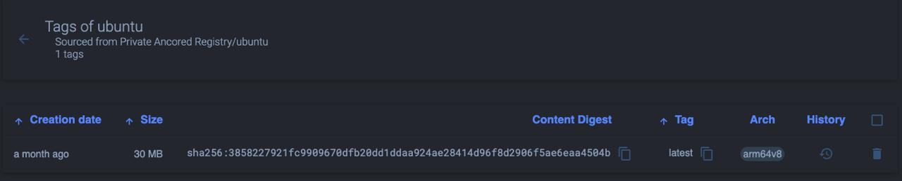

# Установка Docker Private Registry

Руководство по установке Docker Private Registry.

## Подготовка системы

На хосте должны быть установлены Docker и Docker Compose.

## Установка

### 0. Настройка доменов в Compose

В файле docker-compose.yaml находится конфигурация доменных имен для ui и самого registry. Их необходимо поменять на свои доменные имена.

### 1. Развертывание Compose

```sh
docker compose up -d
```

### 2. Настраиваем Reverse Proxy

Reverse Proxy должен иметь следующие записи:
- registry.ancored.ru -> host:5000
- registry-ui.ancored.ru -> host:5001

Необходимо обязательно настроить tls сертификаты для этих доменов. Сертификаты должны предоставлять информацию о всей цепочке CA.
Для этого конкатенируем все имеющиеся сертификаты:
```sh
cat cert.crt intermediate.crt root.crt > fullchain.crt
```

В конфигурации Reverse Proxy необходимо использовать именно fullchain.crt

## Использование

Если сертификаты были настроены правильно, то docker сможет проверить валидность при пуше в registry.

### 1. Тегируем image

```sh
docker tag <image>:[tag] registry.ancored.ru/<image>:[tag]
```

### 2. Пушим в registry

```sh
docker push registry.ancored.ru/<image>:[tag]
```

### 3. Смотрим image в ui



### 4. Запускаем GC

В Compose прдусмотрен механизм сбора мусора. Удалите только что запушенный image и запустите следующую команду:
```sh
docker compose --profile maintenance up registry-gc
```

В логах вы увидите сообщения об удалении image с диска:
```sh
docker-registry-gc  | ubuntu
docker-registry-gc  | 
docker-registry-gc  | 0 blobs marked, 3 blobs and 0 manifests eligible for deletion
docker-registry-gc  | blob eligible for deletion: sha256:40996109e0ff26ebf87f02c239c42e8687836b4a6ca4781d744e0cb117197e4b
docker-registry-gc  | time="2025-06-30T22:19:22.786246689Z" level=info msg="Deleting blob: /docker/registry/v2/blobs/sha256/40/40996109e0ff26ebf87f02c239c42e8687836b4a6ca4781d744e0cb117197e4b" go.version=go1.20.8 instance.id=62357ede-3c93-4d5a-b551-34613f4529a3 service=registry 
docker-registry-gc  | blob eligible for deletion: sha256:9d45648b40307b523984e200d90f737b39a705c335fbf484113d4ad0660d97a6
docker-registry-gc  | blob eligible for deletion: sha256:3858227921fc9909670dfb20dd1ddaa924ae28414d96f8d2906f5ae6eaa4504b
docker-registry-gc  | time="2025-06-30T22:19:22.792407076Z" level=info msg="Deleting blob: /docker/registry/v2/blobs/sha256/9d/9d45648b40307b523984e200d90f737b39a705c335fbf484113d4ad0660d97a6" go.version=go1.20.8 instance.id=62357ede-3c93-4d5a-b551-34613f4529a3 service=registry 
docker-registry-gc  | time="2025-06-30T22:19:22.792659241Z" level=info msg="Deleting blob: /docker/registry/v2/blobs/sha256/38/3858227921fc9909670dfb20dd1ddaa924ae28414d96f8d2906f5ae6eaa4504b" go.version=go1.20.8 instance.id=62357ede-3c93-4d5a-b551-34613f4529a3 service=registry 
docker-registry-gc exited with code 0
```
